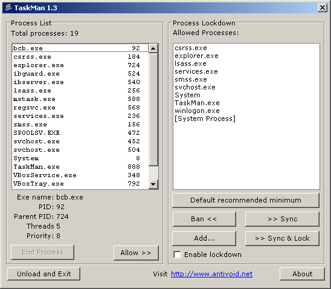

# TaskMan

### About:
A windows task manager with a "lockdown" mode that install kills (and keeps killing) any processes not in an allowed list.

### Instructions:
Run the application, select process in the Process List you want to keep running and click "Allow >>", then check the "Enable lockdown" box.

### Screenshot:

### Info:
**Created:** 2006

**Operating System:** Windows 2000 or newer

**Compile with:** Borland C++ Builder 6
